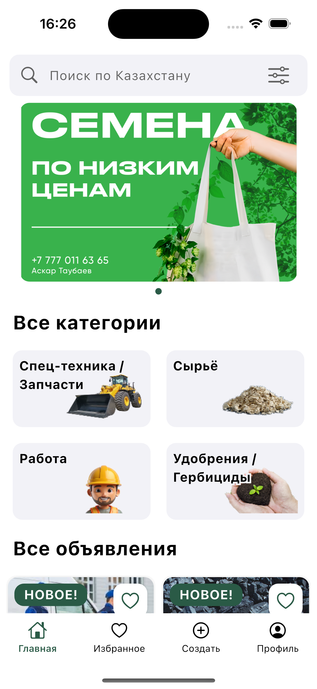
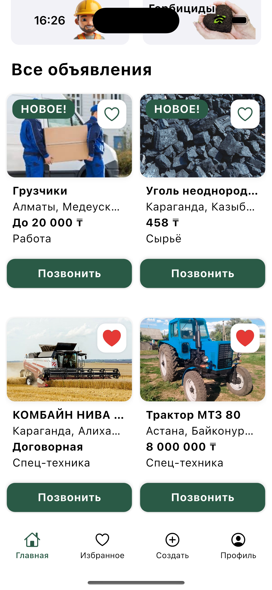
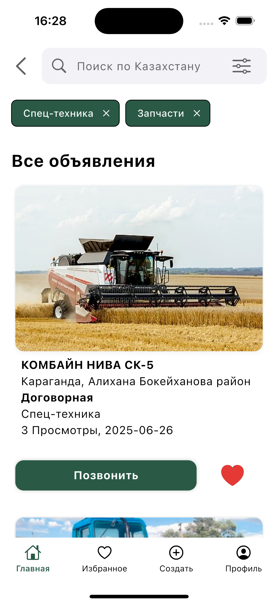
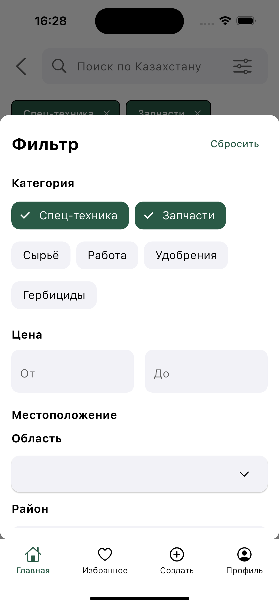
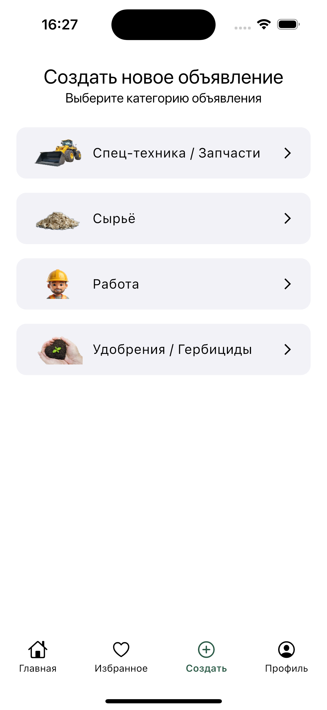

# 🏡 Selo.kz - Современный АгроМаркет

**Selo.kz** is a commercial mobile agro-marketplace built with **Flutter** and **Dart**, designed to transform Kazakhstan’s agricultural sector. With a development budget exceeding **$8000**, this high-quality application connects farmers, businesses, and individuals to buy, sell, or browse agricultural products and services. Crafted with industry-leading practices, Selo.kz delivers a robust, scalable, and highly optimized platform, tailored for Kazakhstan’s agricultural community.


---

## 🌾 About Selo.kz

Selo.kz is Kazakhstan’s first mobile agro-marketplace, enabling seamless trading of agricultural goods like machinery, fertilizers, herbicides, and job opportunities. With a budget over $8000, the project reflects significant investment in quality, delivering a multilingual (Kazakh, Russian, English), free-to-use platform optimized for Android and iOS. Selo.kz combines intuitive design, robust backend integration, and advanced development techniques to serve farmers, entrepreneurs, and individuals across Kazakhstan.

---

## 🛠️ Development Approach

Selo.kz was developed with a focus on quality, performance, and scalability, leveraging cutting-edge Flutter practices. Key aspects of the development process include:

- **Clean Code & SOLID Principles**: The codebase adheres to **Clean Code** guidelines and **SOLID** principles, ensuring readability, maintainability, and extensibility. Components are designed with single responsibility and open-closed principles for flexibility.
- **Clean Architecture**: The project follows **Clean Architecture**, separating concerns into presentation, domain, and data layers. This modular design supports testability and easy feature additions, such as new product categories.
- **Modular Structure**: Organized into independent modules, the codebase enables rapid development and reuse. Dependency injection via **get_it** ensures loose coupling.
- **Maximized Rendering Optimization**:
  - **Const Constructors**: Widgets use `const` constructors to eliminate unnecessary rebuilds, ensuring smooth performance.
  - **Efficient Lists**: `ListView.builder` and `SliverList` handle large datasets with minimal memory usage.
  - **RepaintBoundary**: Complex widgets are isolated with `RepaintBoundary` to minimize redraw areas, enhancing UI responsiveness.
  - **Pagination & Lazy Loading**: Data is fetched incrementally, optimizing network usage and rendering, even on low-end devices.
  - The rendering pipeline is **maximally optimized**, delivering a fluid user experience across diverse hardware.
- **Testing**:
  - **Unit Tests**: Implemented with **Mockito** and **flutter_test** to validate business logic.
  - **Widget Tests**: Use `find.byKey` and `find.byType` to ensure UI reliability, achieving high test coverage.
- **Multi-Platform Support**:
  - Adaptive UI for iOS, Android, and future Web/Desktop platforms using **Platform**, **LayoutBuilder**, **MediaQuery**, and **flutter_adaptive_scaffold**.
  - Consistent experience across screen sizes and operating systems.
- **Code Analysis & Linting**:
  - Configured with `analysis_options.yaml`, enforcing **pedantic**, **effective_dart**, and **very_good_analysis** rules.
  - Static analysis prevents bugs and maintains consistent code style.
- **Monitoring & Analytics**:
  - **Firebase Analytics** tracks user behavior for data-driven enhancements.
  - **Firebase Crashlytics** provides real-time crash reporting for quick issue resolution.
- **Security**:
  - **Firebase App Check** and **reCAPTCHA Enterprise** safeguard against unauthorized access.
  - Firebase encryption ensures secure data handling and transactions.

With a **$8000+ investment**, Selo.kz exemplifies a premium, enterprise-grade Flutter application, built for performance and scalability.

---

## 🧰 Tech Stack

Selo.kz leverages a modern, robust tech stack to deliver a high-performance, scalable application:

- **Framework**: Flutter (cross-platform UI development)
- **Language**: Dart (type-safe, performant)
- **State Management**: Riverpod (scalable, reactive state management)
- **Navigation**: GoRouter (type-safe, declarative routing)
- **Backend**:
  - Firebase Authentication (secure user login)
  - Firestore (real-time NoSQL database)
  - Firebase Storage (media storage)
  - Firebase Messaging (push notifications)
  - Firebase Analytics (user behavior tracking)
  - Firebase Crashlytics (crash reporting)
  - Firebase App Check (app integrity protection)
- **Local Storage**: Hive (lightweight, high-performance key-value store)
- **Networking**: Cached Network Image (optimized image loading), Connectivity Plus (network status monitoring)
- **Media**: Image Picker (photo uploads), Video Player (media playback)
- **Localization**: Flutter Localizations, Intl (multilingual support for Kazakh, Russian, English)
- **Security**: reCAPTCHA Enterprise (bot protection)
- **UI Components**: Carousel Slider (dynamic carousels), Shimmer (loading animations), Pin Code Fields (OTP input), Flutter SVG (vector graphics)
- **Logging & Monitoring**: Talker, Talker Riverpod Logger (custom logging), Firebase Analytics, Firebase Crashlytics
- **Environment**: Flutter Dotenv (secure environment variable management)
- **Other**: URL Launcher (external links), Path Provider (file system access)
- **Development Practices**:
  - Clean Code, SOLID, Clean Architecture
  - Modular architecture with dependency injection (get_it)
  - Unit and widget testing (Mockito, flutter_test)
  - Adaptive UI (flutter_adaptive_scaffold, LayoutBuilder, MediaQuery)
  - Linting (pedantic, effective_dart, very_good_analysis)

---

## 📸 Screenshots

| Home Page | Favourites | Search | Profile | Advert Detail Page | Create Page |
|-----------|------------|--------|---------|--------------------|-------------|
|  <br>  |  <br>  |  <br>  |  <br>  |  <br>  |  <br>  |

---

## 🚀 Getting Started

Follow these steps to set up and run Selo.kz locally:

### Requirements

- Any Operating System (e.g., MacOS X, Linux, Windows)
- Any IDE with Flutter SDK installed (e.g., IntelliJ, Android Studio, VSCode)
- A little knowledge of Dart and Flutter
- A brain to think 🤓

### Installation

1. **Clone the repository**:
   ```bash
   git clone https://github.com/your-username/selo.git
   ```

2. **Navigate to the project directory**:
   ```bash
   cd selo
   ```

3. **Set up environment variables**:
   - Create a `.env` file in the root directory.
   - Add Firebase configuration (e.g., API keys, project ID).
   - Run the environment setup script and select `stage`:
     ```bash
     bash setenv.sh
     ```
     ```
     Выберите окружение:
     1) dev
     2) stage
     3) prod
     #? 2
     ```

4. **Install dependencies**:
   ```bash
   flutter pub get
   ```

5. **Configure Firebase**:
   - Add `google-services.json` (Android) to the `android/app` directory.
   - Add `GoogleService-Info.plist` (iOS) to the `ios/Runner` directory.
   - Enable Firebase services (Authentication, Firestore, Storage, Messaging, Analytics, Crashlytics, App Check) in the Firebase Console.

6. **Run the app**:
   ```bash
   flutter run
   ```

---

## 📫 Contact

For questions, feedback, or support:

- **Email**: [selokz.app@gmail.com](mailto:selokz.app@gmail.com)
- **GitHub Issues**: [Open an issue](https://github.com/your-username/selo/issues)
- **Privacy Policy**: [View here](https://sites.google.com/view/privacypolicyselo/%D0%B3%D0%BB%D0%B0%D0%B2%D0%BD%D0%B0%D1%8F-%D1%81%D1%82%D1%80%D0%B0%D0%BD%D0%B8%D1%86%D0%B0)
- **Download Selo.kz**:
  - [Google Play Store](https://play.google.com/store/apps/details?id=com.selo.app)
  - [App Store](https://apps.apple.com/kz/app/selo-kz/id6747386777)

---

*Built with ❤️ for Kazakhstan’s agricultural community*
